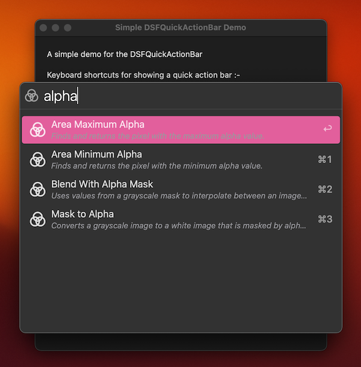
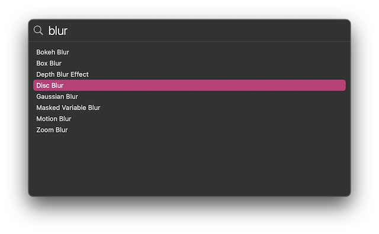

# DSFQuickActionBar

A spotlight-inspired quick action bar for macOS.

<p align="center">
    
    
    
    
    <a href="https://swift.org/package-manager">
        </a>
    
</p>

<p align="center">
   <a href="https://github.com/dagronf/dagronf.github.io/blob/master/art/projects/DSFQuickActionBar/qab_search.png?raw=true">
      </a>
   </a>
   <a href="https://github.com/dagronf/dagronf.github.io/blob/master/art/projects/DSFQuickActionBar/qab_results.png?raw=true">
      </a>
   </a>
   <a href="./Art/kbd-shortcuts.png">
      </a>
   </a>
</p>

## Why?

I've seen this in other mac applications (particularly Spotlight and [Boop](https://apps.apple.com/us/app/boop/id1518425043?mt=12)) and it's very useful and convenient.

## Features

* macOS AppKit Swift Support
* macOS AppKit SwiftUI Support
* Completely keyboard navigable
* Optional keyboard shortcuts
* Asynchronous API to avoid beachballing on complex queries.

You can present a quick action bar in the context of a window (where it will be centered above and within the bounds of the window as is shown in the image above) or centered in the current screen (like Spotlight currently does).

## Demos

You can find macOS demo apps in the `Demos` subfolder.

* `Simple Demo` - a simple AppKit application demonstrating a synchronous quick action bar using AppKit, SwiftUI and custom cell types
* `Doco Demo` - AppKit demo used for generating images for the website
* `Faux Spotlight` - An AppKit demo showing asynchronous searching support using MDItemQuery()
* `SwiftUI Demo` - A SwiftUI demonstration
* `StatusBar Item Demo` - Demonstrates displaying a quick action bar from a statusbar item (in the menu). 

## Process

1. Present the quick action bar, automatically focussing on the edit field so your hands can stay on the keyboard
2. User starts typing in the search field
3. For each change to the search term -
   1. The contentSource will be asked for the item(s) that 'match' the search term (`itemsForSearchTerm`). The `items` request is asynchronous, and can be completed at any point in the future (as long as it hasn't been cancelled by another search request)
   2. For each item, the contentSource will be asked to provide a view which will appear in the result table for that item (`viewForItem`)
   3. When the user either double-clicks on, or presses the return key on a selected item row, the contentSource will be provided with the item (`didActivateItem`)
4. The quick action bar will automatically dismiss if
	1. The user clicks outside the quick action bar (ie. it loses focus)
	2. The user presses the escape key
	3. The user double-clicks an item in the result table
	4. The user selects a row and presses 'return'

## Implementing for AppKit

You present a quick action bar by :-

1. creating an instance of `DSFQuickActionBar` 
2. set the content source on the instance
3. call the `present` method.

### Presenting

Call the `present` method on the quick action bar instance.

| Name                  | Type       | Description |
|-----------------------|------------|-------------|
| parentWindow          | `NSWindow` | The window to present the quick action bar over, or nil to display for the current screen (ala Finder Spotlight) |
| placeholderText       | `String`   | The placeholder text to display in the edit field |
| searchImage           | `NSImage`  | The image to display on the left of the search edit field. If nil, uses the default magnifying glass image |
| initialSearchText     | `String`   | Provide an initial search string to appear when the bar displays |
| width                 | `CGFloat`  | Force the width of the action bar |
| showKeyboardShortcuts | `Bool`     | Display keyboard shortcuts (↩︎, ⌘1 -> ⌘9) for the first 10 selectable items |
| didClose              | callback   | Called when the quick action bar closes |

### Content Source

The contentSource (`DSFQuickActionBarContentSource`) provides the content and feedback for the quick action bar. The basic mechanism is similar to `NSTableViewDataSource`/`NSTableViewDelegate` in that the control will :-

1. query the contentSource for items matching a search term (itemsForSearchTerm)
2. ask the contentSource for a view for each displayed item (viewForItem)
3. indicate that the user has pressed/clicked a selection in the results.
4. (optional) indicate to the contentSource that the quick action bar has been dismissed.

## Delegate style content source

#### itemsForSearchTermTask

```swift
func quickActionBar(_ quickActionBar: DSFQuickActionBar, itemsForSearchTermTask task: DSFQuickActionBar.SearchTask)
```

Called when the control needs a array of items to display within the control that match a search term.
The definition of 'match' is entirely up to you - you can perform any check you want. 

The `task` object contains the search term and a completion block to call when the search results become 
available. If the search text changes during an asynchronous search call the task is marked as invalid and the
result will be ignored.

##### Simple synchronous example

If you have code using the old synchronous API, it's relatively straightforward to convert your existing code
to the new api. 

```swift
func quickActionBar(_ quickActionBar: DSFQuickActionBar, itemsForSearchTermTask task: DSFQuickActionBar.SearchTask)
   let results = countryNames.filter { $0.name.startsWith(task.searchTerm) }
   task.complete(with: results)
}
```

##### Simple asynchronous example

```swift
var currentSearch: SomeRemoteSearchMechanism?
func quickActionBar(_ quickActionBar: DSFQuickActionBar, itemsForSearchTermTask task: DSFQuickActionBar.SearchTask)
   currentSearch?.cancel()
   currentSearch = SomeRemoteSearchMechanism(task.searchTerm) { [weak self] results in
      task.complete(with: results)
      self?.currentSearch = nil
   }
}
```

---

#### viewForItem

```swift
func quickActionBar(_ quickActionBar: DSFQuickActionBar, viewForItem item: AnyHashable, searchTerm: String) -> NSView?
```

Return the view to be displayed in the row for the item. The search term is also provided to allow the view to be customized for the search term (eg. highlighting the match in the name)

---

#### canSelectItem

```swift
func quickActionBar(_ quickActionBar: DSFQuickActionBar, canSelectItem item: AnyHashable) -> Bool
```

Called when a item will be selected (eg. by keyboard navigation or clicking). Return false if this row should not be selected (eg. it's a separator)

---

#### didSelectItem

```swift
func quickActionBar(_ quickActionBar: DSFQuickActionBar, didSelectItem item: AnyHashable)
```

Called when an item is selected within the list.

---

#### didActivateItem

```swift
// Swift
func quickActionBar(_ quickActionBar: DSFQuickActionBar, didActivateItem item: AnyHashable)
```

Indicates the user activated an item in the result list. The 'item' parameter is the item that was selected by the user

---

#### didCancel

```swift
func quickActionBarDidCancel(_ quickActionBar: DSFQuickActionBar)
```

Called if the user cancels the quick action bar (eg. by hitting the `esc` key or clicking outside the bar)

---

<details>
<summary>Swift Example</summary>

### Swift Example

A simple AppKit example using Core Image Filters as the contentSource.

```swift
class ViewController: NSViewController {
   let quickActionBar = DSFQuickActionBar()
   override func viewDidLoad() {
      super.viewDidLoad()

      // Set the content source for the quick action bar
      quickActionBar.contentSource = self
   }

   @IBAction func selectFilter(_ sender: Any) {
      // Present the quick action bar
      quickActionBar.present(placeholderText: "Search for filters…")
   }
}

// ContentSource delegate calls
extension ViewController: DSFQuickActionBarContentSource {
   func quickActionBar(_ quickActionBar: DSFQuickActionBar, itemsForSearchTerm searchTerm: String) -> [AnyHashable] {
      return Filter.search(searchTerm)
   }

   func quickActionBar(_ quickActionBar: DSFQuickActionBar, viewForItem item: AnyHashable, searchTerm: String) -> NSView? {
      guard let filter = item as? Filter else { fatalError() }
      // For the demo, just return a simple text field with the filter's name
      return NSTextField(labelWithString: filter.userPresenting)
   }

   func quickActionBar(_ quickActionBar: DSFQuickActionBar, didActivateItem item: AnyHashable) {
      Swift.print("Activated item \(item as? Filter)")
   }
   
   func quickActionBarDidCancel(_ quickActionBar: DSFQuickActionBar) {
      Swift.print("Cancelled!")
   }
}

// the datasource for the Quick action bar. Each filter represents a CIFilter
struct Filter: Hashable, CustomStringConvertible {
   let name: String // The name is unique within our dataset, thus the default equality will be enough to uniquely identify
   var userPresenting: String { return CIFilter.localizedName(forFilterName: self.name) ?? self.name }
   var description: String { name }

   // All of the available filters
   static var AllFilters: [Filter] = {
      let filterNames = CIFilter.filterNames(inCategory: nil).sorted()
      return filterNames.map { name in Filter(name: name) }
   }()

   // Return filters matching the search term
   static func search(_ searchTerm: String) -> [Filter] {
      if searchTerm.isEmpty { return AllFilters }
      return Filter.AllFilters
         .filter { $0.userPresenting.localizedCaseInsensitiveContains(searchTerm) }
         .sorted(by: { a, b in a.userPresenting < b.userPresenting })
   }
}
```



</details>

## SwiftUI interface

The SwiftUI implementation is a View. You 'install' the quick action bar just like you would any other SwiftUI view.
The `QuickActionBar` view is zero-sized, and does not display content within the view its installed on.

```swift
QuickActionBar<IdentifyingObject, IdentifyingObjectView>
```

The QuickActionBar template parameters represent 

* `IdentifyingObject` is the type of the object (eg. `URL`)
* `IdentifyingObjectView` is the type of View used to represent `IdentifyingObject` in the results list (eg. `Text`)

You present the quick action bar by setting the `visible` parameter to true.

For example :-

```swift
@State var quickActionBarVisible = false
@State var selectedItem: URL = URL(...)
...
VStack {
   Button("Show Quick Action Bar") {
      quickActionBarVisible = true
   }
   QuickActionBar<URL, Text>(
      location: .window,
      visible: $quickActionBarVisible,
      selectedItem: $selectedItem,
      placeholderText: "Open Quickly",
      itemsForSearchTerm: { searchTask in
         let results = /* array of matching URLs */
         searchTask.complete(with: results)
      },
      viewForItem: { url, searchTerm in
         Text(url.path)
      }
   )
   .onChange(of: selectedItem) { newValue in
      Swift.print("Selected item \(newValue)")
   }
}
...
```

| Parameter               | Description              |
|:------------------------|:-------------------------|
| `location`              | Where to locate the quick action bar (.window, .screen) |
| `visible`               | If true, presents the quick action bar on the screen |
| `showKeyboardShortcuts` | Display keyboard shortcuts for the first 10 selectable items |
| `requiredClickCount`    | If `.single`, only requires the user to single-click a row to activate it (defaults to `.double`) |
| `barWidth`              | The width of the presented bar |
| `searchTerm`            | The search term to use, updated when the quick action bar is closed |
| `selectedItem`          | The item selected by the user |
| `placeholderText`       | The text to display in the quick action bar when the search term is empty |
| `itemsForSearchTerm`    | A block which returns the item(s) for the specified search term |
| `viewForItem`           | A block which returns the View to display for the specified item |

<details>
<summary>SwiftUI Example</summary>

### SwiftUI Example

A simple macOS SwiftUI example using Core Image Filters as the content.

#### SwiftUI View

```swift
struct DocoContentView: View {
   // Binding to update when the user selects a filter
   @State var selectedFilter: Filter?
   // Binding to show/hide the quick action bar
   @State var quickActionBarVisible = false

   var body: some View {
      VStack {
         Button("Show Quick Action Bar") {
            quickActionBarVisible = true
         }
         QuickActionBar<Filter, Text>(
            location: .screen,
            visible: $quickActionBarVisible,
            selectedItem: $selectedFilter,
            placeholderText: "Open Quickly...",
            itemsForSearchTerm: { searchTask in
               let results = filters__.search(searchTask.searchTerm)
               searchTask.complete(with: results)
            },
            viewForItem: { filter, searchTerm in
               Text(filter.userPresenting)
            }
         )
      }
   }
}
```

#### Data

```swift
/// The unique object used as the quick action bar item
struct Filter: Hashable, CustomStringConvertible {
   let name: String // The name is unique within our dataset, therefore it will be our identifier
   var userPresenting: String { return CIFilter.localizedName(forFilterName: self.name) ?? self.name }
   var description: String { name }
}

class Filters {
   // If true, displays all of the filters if the search term is empty
   var showAllIfEmpty = true

   // All the filters
   var all: [Filter] = {
      let filterNames = CIFilter.filterNames(inCategory: nil).sorted()
      return filterNames.map { name in Filter(name: name) }
   }()

   // Return filters matching the search term
   func search(_ searchTerm: String) -> [Filter] {
      if searchTerm.isEmpty && showAllIfEmpty { return all }
      return all
         .filter { $0.userPresenting.localizedCaseInsensitiveContains(searchTerm) }
         .sorted(by: { a, b in a.userPresenting < b.userPresenting })
   }
}

let filters__ = Filters()
```

</details>

## Screenshots

<p align="center">
   <a href="https://github.com/dagronf/dagronf.github.io/blob/master/art/projects/DSFQuickActionBar/filters-empty.png?raw=true">
      </a>
   </a><br/>
   <a href="https://github.com/dagronf/dagronf.github.io/blob/master/art/projects/DSFQuickActionBar/filter.png?raw=true">
      </a>
   </a>
</p>

## Releases

### 5.0.0

* **[BREAKING API]** Move to using an asynchronous API for the item search to allow background searching without locking up the UI.

### 4.1.0

* Added optional keyboard shortcuts. Defaults to off to make sure existing projects don't change their behaviour.

### 4.0.0

* Added ability to mark a row as not selectable (eg. if you want to add a separator item in the results). `canSelectItem` added to the delegate callback. By default, all rows are selectable.

UI changes to move the UX implementation closer to that of Spotlight/Open Quickly (Xcode).

* First search result is selected by default.
* Typing in the edit field and using the up/down arrows does not change the UI focus to the result view, the result selection moves but the focus is not removed from the edit field
* Set the number of clicks required to 'activate' an item (`requiredClickCount`). Default to double-click.

### 3.0.5 BREAKING CHANGES

There have been some breaking changes for those moving up from v2 or earlier to v3. This changes were to make the codebase more generic and to improve the SwiftUI support.
Please be aware your existing code *will* need changes to support the new v3 codebase.

* The UUID identifier has been replaced with a `Hashable` type. This allows other types to be used as an identifier (eg. `URL` or even structs/classes). 
* 'Identifier' used within the API has been changed to `Item` (eg. `viewForIdentifier` -> `viewForItem`)
* The `didSelectItem` delegate callback is now used when the item is _selected_, not activated. `didActivateItem` is called when the user 'activates' (ie. double-clicks or keyboard selects) a row
* The SwiftUI implementation has been changed to be much more SwiftUI-y. Please see the [Implementing for SwiftUI](#implementing-for-swiftui) section for details.

### 2.0.2

* Updated demo for updated DSFAppKitBuilder

### 2.0.1

* Updated demo for updated DSFAppKitBuilder

### 2.0.0

**Note** the delegate API has changed for this version, hence moving to 2.0.0 to avoid automatic breakages

* Changed `viewForItem` delegate method to also pass the current search term.
* Changed the code to use `searchTerm` (instead of `term`) consistently throughout the library

### 1.1.1

* Fixed silly runtime error for dynamic rows

### 1.1.0

* Changed the demo apps data from using 'Mountains' to using Core Image Filter definitions.

### 1.0.0

* Added initial SwiftUI support
* Changed 'delegate' to 'contentSource'

### 0.5.1

* Fixed bugs in documentation

### 0.5.0

* Initial release

## License

MIT. Use it and abuse it for anything you want, just attribute my work. Let me know if you do use it somewhere, I'd love to hear about it!

```
MIT License

Copyright © 2022 Darren Ford

Permission is hereby granted, free of charge, to any person obtaining a copy
of this software and associated documentation files (the "Software"), to deal
in the Software without restriction, including without limitation the rights
to use, copy, modify, merge, publish, distribute, sublicense, and/or sell
copies of the Software, and to permit persons to whom the Software is
furnished to do so, subject to the following conditions:

The above copyright notice and this permission notice shall be included in all
copies or substantial portions of the Software.

THE SOFTWARE IS PROVIDED "AS IS", WITHOUT WARRANTY OF ANY KIND, EXPRESS OR
IMPLIED, INCLUDING BUT NOT LIMITED TO THE WARRANTIES OF MERCHANTABILITY,
FITNESS FOR A PARTICULAR PURPOSE AND NONINFRINGEMENT. IN NO EVENT SHALL THE
AUTHORS OR COPYRIGHT HOLDERS BE LIABLE FOR ANY CLAIM, DAMAGES OR OTHER
LIABILITY, WHETHER IN AN ACTION OF CONTRACT, TORT OR OTHERWISE, ARISING FROM,
OUT OF OR IN CONNECTION WITH THE SOFTWARE OR THE USE OR OTHER DEALINGS IN THE
SOFTWARE.
```
